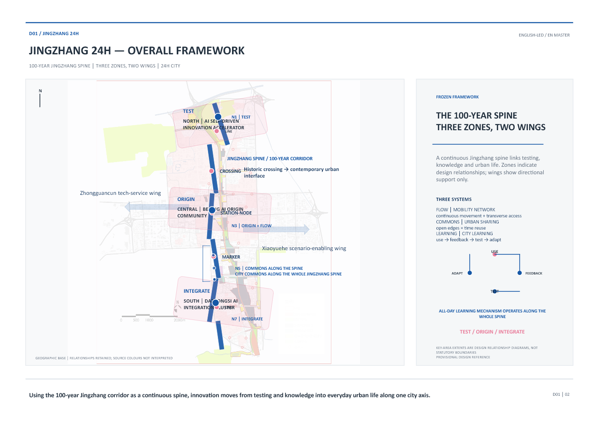
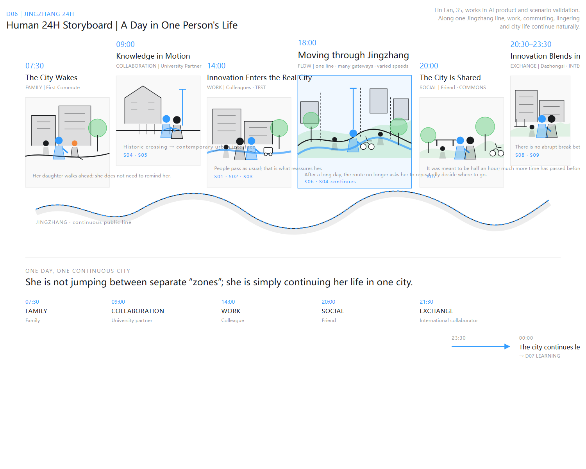
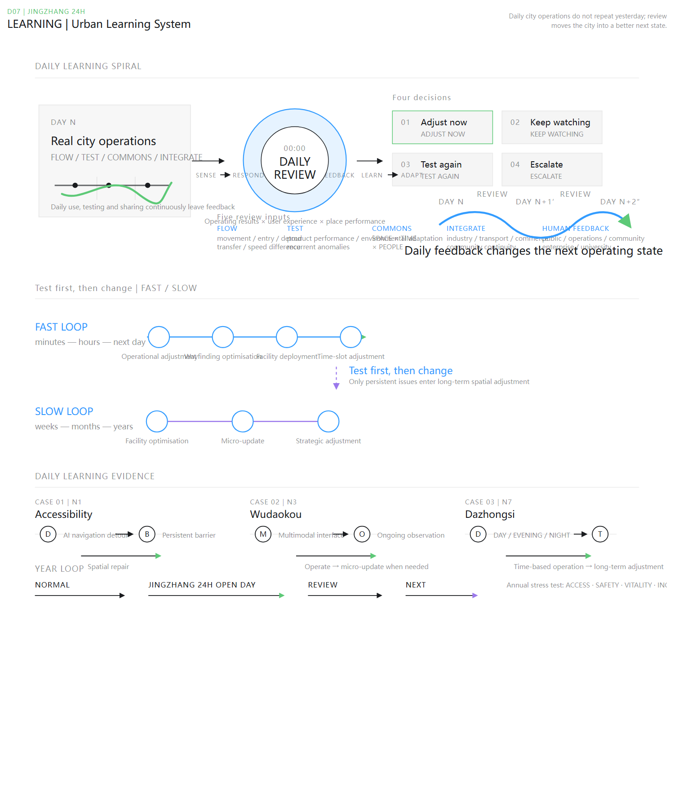

# PART 0 | JINGZHANG 24H

## Executive Summary

**JINGZHANG 24H** is structured around **“A Day of a Person × A City that Learns.”** It asks how the Jingzhang corridor, already shaped by public space, mobility infrastructure, industry, and knowledge resources, can evolve in the AI era into a continuous urban spine connecting innovation, work, movement, sharing, and everyday life.

The proposal is organized through the **Centennial Jingzhang Spine + Three Zones and Two Wings**: Zhongzhiyuan in the north operates as **TEST**; the Beijing AI Origin Community in the middle operates as **ORIGIN**; and Dazhongsi in the south operates as **INTEGRATE**. The Zhongguancun Technology Service Wing and Xiaoyue River Scenario Empowerment Wing provide supporting knowledge, industry, and application resources. The three areas are a continuous sequence of innovation generation, real-world validation, and urban integration rather than isolated functional islands.

Three systems support this structure: **FLOW, COMMONS, and LEARNING**. FLOW enables continuous movement at different speeds and for different purposes. COMMONS shares existing resources through open edges, time-based reuse, and mixed use. LEARNING connects short-cycle operation with longer-term micro-renewal through real use, testing, operation, voluntary public feedback, and the principle of “test first, then adapt.”

These mechanisms are experienced through one day in the life of Lin Lan, a 35-year-old professional in AI product and scenario validation: family life at 07:30, knowledge exchange at Wudaokou at 09:00, real-city testing in Zhongzhiyuan at 14:00, a southbound journey through Jingzhang at 18:00, shared public life at 20:00, and continued work, exchange, and urban life in Dazhongsi between 20:30 and 23:30. At 23:30 her day ends; at 00:00, the city enters its **DAILY REVIEW**, translating FLOW, TEST, COMMONS, INTEGRATE, public, and operational feedback into the next operational state.

JINGZHANG 24H does not depend on one-time large-scale reconstruction. It extends Jingzhang’s evolution from **railway connection → urban public corridor → AI-era innovation and commons spine**, using minimum necessary intervention, real-world testing, and continuous urban learning so innovation becomes part of ordinary city life. [source:FROZEN-DESIGN-SPEC-V1] [drawing:D01] [drawing:D06] [drawing:D07]

# PART 1 | THE CITY WE START FROM

## 1.1 Existing Jingzhang

Jingzhang is not an urban blank waiting to be reinvented. From railway infrastructure once connecting the city and region to today’s heritage, park, and public-space corridor through Haidian, it has consistently played a role of connection. Its legacy is not limited to railway heritage; it is also a continuous urban corridor passing universities, research institutions, industry clusters, communities, commerce, and transport nodes.

Significant innovation resources are concentrated along this corridor. Zhongzhiyuan in the north, the Beijing AI Origin Community in the middle, and Dazhongsi in the south form three major innovation areas. Zhongguancun, university research resources, Xiaoyue River, surrounding communities, commerce, and public services form a broader support network. The proposal therefore begins with Jingzhang as an existing public urban spine with real everyday life, asking how its relationship with innovation can be further organized.

### Jingzhang cultural continuity

Jingzhang’s cultural continuity is understood as **railway infrastructure → urban green public corridor → AI-era innovation and commons spine**. Historical Jingzhang represented connection, engineering, and pioneering; contemporary Zhongguancun continues exploration, entrepreneurship, and openness; JINGZHANG 24H translates these qualities into co-creation, testing, sharing, and learning. Specific historical facts, heritage conditions, and identifiers still require FACT sources; this cultural translation is PROPOSAL. [source:FROZEN-DESIGN-SPEC-V1] [drawing:D01]

## 1.2 Opportunities & Gaps

The challenge is not a lack of innovation resources, but how they become part of the same city. University knowledge, enterprise technology, everyday community needs, transit movement, and existing public space do not automatically connect because they are geographically close. For ordinary users they may still appear as separate boundaries, access conditions, and temporal states.

The proposal reorganizes three relationships. First, innovation and the real city: AI must move from controlled environments into real use without interrupting normal urban life, and repeated problems must feed back into improvement. Second, innovation resources and public life: rather than indiscriminately opening institutional cores, the focus is urban-facing edges, forecourts, shared periods, and collaboration interfaces, with a gradient from public to shared, controlled, and private space. Third, the three key areas: FLOW, COMMONS, and LEARNING organize Zhongzhiyuan, the AI Origin Community, and Dazhongsi into a continuous sequence from innovation generation to validation and urban integration.

JINGZHANG 24H therefore asks how existing innovation resources, public spaces, and ordinary life can begin to interact along the same corridor, rather than merely creating more “AI spaces.” [source:FROZEN-DESIGN-SPEC-V1] [drawing:D01] [drawing:D06]

## 1.3 Evidence & Uncertainty

The proposal is grounded in official public documents, existing planning and task materials, verifiable spatial relationships, available mapping, and limited field imagery. Confirmable information establishes overall structure, node relationships, and intervention directions, including the corridor, key-area positioning, major transport connections, and the general distribution of universities, industry, communities, blue-green space, and public facilities.

Information that cannot be verified is not converted into design fact. Precise statutory boundaries, land and building ownership, development intensity, building-height controls, demolition permissions, municipal capacity, and certain underground conditions remain **UNKNOWN / TO VERIFY**. Drawings that communicate spatial relationships without statutory boundaries are labelled **PROVISIONAL DESIGN REFERENCE**, not official regulatory boundaries.

This evidence boundary shapes the method: retain-first, minimum necessary intervention, real-world testing, and incremental adaptation take priority over unsupported redevelopment or quantitative controls. What can be verified becomes evidence; what remains uncertain becomes an implementation prerequisite; what cannot be proven is not presented as fact. [source:SOURCE-REGISTRY] [source:FROZEN-DESIGN-SPEC-V1] [assumption:A-CONTROLS-001]

**[FIGURE｜Evidence + Assumption / Provisional Boundary Note｜DRAWING TODO]**

# PART 2 | JINGZHANG 24H FRAMEWORK

## How One Day Organizes a City

JINGZHANG 24H organizes space, use, testing, and feedback through “A Day of a Person × A City that Learns.” Human time explains lived urban experience; city time carries real use, operation, and public feedback into the next operating state. The framework maintains only the frozen relationships of TEST, ORIGIN, INTEGRATE, FLOW, COMMONS, and LEARNING; it introduces no additional first-level system or concept. [source:FROZEN-DESIGN-SPEC-V1] [drawing:D01] [drawing:D06] [drawing:D07]

## 2.1 Two 24 Hours

The “24H” in JINGZHANG 24H does not refer only to one person’s schedule. The proposal contains two intertwined 24-hour cycles. The first is a day of a person: from 07:30 through family life, knowledge exchange, work testing, commuting, sharing, and urban life, ending at 23:30. It is linear and reveals the city through ordinary use. The second is a day of the city: throughout the day the city senses real use, testing results, spatial conditions, and operational feedback. At 00:00 it enters a **DAILY REVIEW**; midnight is not the start of learning, but the moment accumulated information is reconsidered for the next operational, testing, or spatial state.

The two timelines are related but not identical: the protagonist helps us see the city; LEARNING helps the city see itself. Human time moves forward, while urban learning forms a cycle. DAY N is not reset at midnight; it becomes a modified DAY N+1 shaped by what has been learned. [source:FROZEN-DESIGN-SPEC-V1] [drawing:D06] [drawing:D07]

See D06 in Part 3 — Human 24H Storyboard.

See D07 in Part 9 — Urban Learning System.

## 2.2 The Centennial Jingzhang Spine + Three Districts and Two Wings

The Centennial Jingzhang Spine is the continuous framework. It is not a new functional corridor, but builds on existing Jingzhang heritage, parks, transport, and public space to connect innovation resources, public life, and urban learning. From north to south, Zhongzhiyuan operates as **TEST**, progressively validating innovation across controlled, shared, and real urban environments; the Beijing AI Origin Community operates as **ORIGIN**, bringing university, research, and innovation resources into public space through urban interfaces; Dazhongsi operates as **INTEGRATE**, where industry, transit, commerce, community, public space, and international exchange coexist. The areas are neither hierarchical nor interchangeable labels; together they form a sequence from knowledge and innovation, through real-city validation, to industry and everyday urban life.

The Zhongguancun Technology Service Wing and Xiaoyue River Scenario Empowerment Wing support knowledge, industry services, and real-world application conditions on either side; they are relationships, not additional first-level systems. Cultural DNA retains spatial vocabulary rather than reproducing nostalgic railway scenery: **LINE, STATION / NODE, CROSSING, MILEAGE / MARKER, CONNECTION**. Wudaokou is the clearest transformation: **Historical Crossing → Contemporary Urban Interface**. Continuity extends connection, engineering, and pioneering through exploration, entrepreneurship, and openness toward co-creation, testing, sharing, and learning. [source:FROZEN-DESIGN-SPEC-V1] [drawing:D01] [depth:overall_spatial_structure]

## 2.3 Three Urban Systems

JINGZHANG 24H introduces no additional first-level systems. **FLOW** addresses continuous movement through Jingzhang through one line, multiple interfaces, and differentiated speeds, coordinating walking, cycling, accessibility, stopping, transfer, and necessary testing movement. Its purpose is not a faster corridor, but less repeated judgement, detour, and switching for users.

**COMMONS** addresses how existing resources are reasonably shared. It combines open edges, time reuse, and mixed functions through the gradient **PUBLIC → SHARED → CONTROLLED → PRIVATE**. Through **SPACE × TIME × PEOPLE**, the same space serves different users at different times; COMMONS does not simply construct more public space, but creates a more effective sharing-operation network of existing space, facilities, activity, and innovation resources.

**LEARNING** addresses how the city changes through real use. It is not a centralized “AI brain,” but the continuing process **SENSE → RESPOND → TEST → FEEDBACK → LEARN → ADAPT**. Short-cycle issues can be addressed through operation, guidance, facility dispatch, and scheduling; persistent issues may enter facility optimization, micro-renewal, or longer-term strategic adjustment. The principle is “test first, then adapt.” AI assists pattern recognition, recurring-anomaly detection, need matching, and comparison; people retain spatial and governance decisions. [source:FROZEN-DESIGN-SPEC-V1] [drawing:D01] [drawing:D07]

### Ten Real-City AI Scenarios (formal index)

AI is not a separate technology display. Ten Scenario Cards embed AI in ordinary use, real-world testing, spatial operation, and daily learning: 09:00—S04/S05 (multimodal-crossing conflict recognition / knowledge-event matching); 14:00—S01/S02/S03 (robot passage / accessible navigation and spatial repair / public-space environmental adaptation); 18:00—S06 and continuing S04 (station-city arrival and bicycle-parking coordination / continued FLOW feedback); 20:00—S07 (SPACE × TIME × PEOPLE matching); 20:30–23:30—S08/S09 (Dazhongsi day–evening–night transition / multilingual visitor guidance); 00:00—S10 (daily learning and micro-renewal priority). They are lightweight 24H references; complete cards, AI roles, data governance, and spatial response are in Part 12. [source:FROZEN-DESIGN-SPEC-V1] [drawing:D08] [scenario:S01] [scenario:S02] [scenario:S03]

# PART 3 | 07:30 — CITY AWAKENS

At 07:30, Lin Lan begins the day with her daughter. For them, JINGZHANG 24H is not first experienced as an AI system, but as an ordinary journey between family life, school, and work. Children, older residents, cyclists, commuters, and community users enter the city at the same time; urban space must first provide continuity, safety, and legibility.

FLOW remains deliberately quiet. Continuous walking routes, accessible movement, clear lateral connections, and coordinated slow-mobility conditions allow people of different ages and speeds to share the same network without repeatedly deciding where to move or detour. Lin Lan does not feel that she is “using an urban system.” She simply sees her daughter walking ahead without constant reminders to slow down.

This is JINGZHANG 24H’s starting point: technology recedes behind everyday life, and the city first remains a city that can be used naturally. No independent AI Scenario is assigned to 07:30. Stable, ordinary, undisturbed use is the baseline for later urban learning. [source:FROZEN-DESIGN-SPEC-V1] [drawing:D06]

# PART 4 | 09:00 — KNOWLEDGE FLOWS

## Knowledge Moves Beyond Campus

### ORIGIN

### N3 Wudaokou

At 09:00, Lin Lan meets a university collaborator at Wudaokou. Here, Jingzhang’s north-south continuity intersects with Chengfu Road’s east-west activity. Universities, communities, transit, commerce, and Jingzhang public space meet in a compact area, making Wudaokou both a transport node and a key interface through which knowledge enters the city.

The proposal does not indiscriminately open university core research space. Instead, it opens edges: campus forecourts, urban interfaces, short-term exchange space, public presentation, and shared periods for collaboration. ORIGIN therefore does not create another innovation centre; it allows knowledge to move beyond campus.

The railway crossing gains contemporary meaning: **Historical Crossing → Contemporary Urban Interface**. FLOW coordinates directions and speeds through LEAD → SLOW → SWITCH → RELEASE, while COMMONS lets selected institutional knowledge activities enter public urban life under appropriate spatial and temporal conditions. S04 identifies repeated multimodal conflict patterns from anonymized movement information; S05 supports matching between open activities, spaces, and participants. Openness, spatial use, and adjustment remain human responsibilities. Exact historical information and site relationships remain DATA TODO / TO VERIFY. [source:FROZEN-DESIGN-SPEC-V1] [drawing:D03] [scenario:S04] [scenario:S05]

**[FIGURE D03｜N3 ORIGIN × FLOW｜DRAWING TODO]**

See D06 — Human 24H Storyboard (09:00 Knowledge Flows).

# PART 5 | 14:00 — INNOVATION MEETS THE CITY

## TEST

### N1 Zhongzhiyuan

At 14:00, Lin Lan and her colleagues enter a real-world validation process in Zhongzhiyuan. When AI moves from laboratories into the city, the question is not only whether it functions, but whether it can coexist with ordinary users, spatial conditions, and environmental change without interrupting everyday life.

TEST follows **T1 CONTROLLED → T2 SHARED → T3 URBAN**. T1 supports controlled validation within enterprise or research environments; T2 is the managed interface between enterprise and city, introducing real users and real conditions; T3 enters genuine public space. T2 is especially important: it is not a closed facility built for AI, but ordinary usable city space first, becoming a validation environment only under clear, safe, and low-interference conditions. The city does not stop for technology.

This node hosts S01 mobile-robot urban passage, S02 accessible navigation and spatial repair, and S03 public-space environmental adaptation. In S02, AI may first help users route around an obstacle. If it persists, it becomes a spatial problem requiring repair. Products are tested by the city, while the city learns from the test. [source:FROZEN-DESIGN-SPEC-V1] [drawing:D02] [scenario:S01] [scenario:S02] [scenario:S03]

**[FIGURE D02｜N1 TEST｜Controlled → Shared → Urban｜DRAWING TODO]**

See D06 — Human 24H Storyboard (14:00 Innovation Meets the Real City).

# PART 6 | 18:00 — THE CITY IN MOTION

## Moving Through Jingzhang

### FLOW

At 18:00, work ends and Lin Lan begins her second commute. Rather than arriving at one isolated node, she moves south through Jingzhang itself. After a full day, the city should not require repeated decisions about direction, route changes, or avoidable detours.

This is FLOW’s fullest urban experience. **One line · multiple interfaces · differentiated speeds** organize continuous movement: Jingzhang is a legible north-south public spine; universities, transit stations, communities, industry, blue-green space, and lateral streets connect through interfaces; walking, cycling, accessibility, stopping, transfer, and appropriately located testing movement are coordinated at different speeds. FLOW neither forces everyone to use Jingzhang nor creates a fastest route; it makes it naturally selectable, continuous, legible, and able to connect with the city.

LINE, CROSSING, STATION-NODE, and JINGZHANG MARKER provide light continuity so users recognize the same spine across changing urban fragments. Railway culture becomes orientation, nodes, and connection rather than decoration. S06 coordinates transit arrival, bicycle parking, and subsequent slow movement; S04 observations continue to inform operational adjustment. For Lin Lan, the outcome is simple: she does not need to relearn the city along the way. Precise mileage, identifiers, railway remnants, and geographic relations remain TO VERIFY. [source:FROZEN-DESIGN-SPEC-V1] [drawing:D06] [scenario:S06] [scenario:S04]

See D06 — Human 24H Storyboard (18:00 Through Jingzhang).

**[FIGURE｜FLOW｜One Line · Multiple Interfaces · Differentiated Speeds｜DRAWING TODO]**

# PART 7 | 20:00 — THE CITY BECOMES COMMON

## N5 JINGZHANG COMMONS NETWORK

At 20:00, Lin Lan meets a friend. She shifts from moving to staying, and the value of urban space shifts from efficiency to use. Jingzhang already contains sports, children’s activity, cycling, green space, commerce, and ordinary public space. COMMONS therefore does not add another set of shared spaces; it changes how existing resources are used—from spatial provision to shared operation.

COMMONS works through **open edges · reuse time · mix functions**. Through **SPACE × TIME × PEOPLE**, one place can serve different people at different times. Daytime can serve commuters and workers; evenings can serve friends, families, or sport; selected institutional forecourts and public interfaces may host open activities at appropriate times. Quiet, maintenance, ecological recovery, and ordinary unprogrammed use remain legitimate urban time. Sharing never means continuous programming or unrestricted access; the gradient remains **PUBLIC → SHARED → CONTROLLED → PRIVATE**.

Lin Lan and her friend intend only a brief meeting, but much longer passes. The space requires no event participation and does not announce an “innovation city”; she simply chooses to stay. This is COMMONS’s essential outcome. S07 supports SPACE × TIME × PEOPLE matching. [source:FROZEN-DESIGN-SPEC-V1] [drawing:D04] [drawing:D06] [scenario:S07]

**[FIGURE D04｜JINGZHANG COMMONS NETWORK｜DRAWING TODO]**

See D06 — Human 24H Storyboard (20:00 The City Becomes Common).

# PART 8 | 20:00–23:30 — INNOVATION BECOMES URBAN LIFE

## INTEGRATE

### N7 Dazhongsi

After 20:30, Lin Lan continues south into Dazhongsi. Unlike Zhongzhiyuan and Wudaokou, Dazhongsi already has mature industry, offices, commerce, communities, transit, and public life. INTEGRATE does not create another isolated AI park; it addresses how innovation becomes embedded in a complex urban centre.

The sequence is **Jingzhang → Dazhongsi Station → North Third Ring quadrants → enterprise and renewal spaces → commerce and public space → community**. FLOW shifts from passage to arrival. The proposal does not depend on one monumental plaza; it connects transit, walking, cycling, commercial forecourts, industrial interfaces, and community public space. Continuity means spatial arrival, functional change through the day, and coexistence of different people in one urban environment.

By day the area supports work and industry; in the evening transport, commerce, and public space take on more activity; at night residents, friends, visitors, and continuing industry form another urban state. INTEGRATE is not a nightlife district, but the continuity of industry, commerce, transit, public service, community, culture, international exchange, and ordinary life. S08 supports understanding day–evening–night states and recurring issues; S09 supports multilingual guidance and innovation-resource discovery for first-time international visitors, while digital guidance cannot replace a city that is physically legible.

At 23:30 Lin Lan’s day ends, without an abrupt boundary between work and life. At 00:00 the narrative passes to the city. Exact space, cultural layering, and geographic relations remain subject to real evidence and TO VERIFY. [source:FROZEN-DESIGN-SPEC-V1] [drawing:D05] [drawing:D06] [scenario:S08] [scenario:S09]

**[FIGURE D05｜N7 INTEGRATE｜Continuous Dazhongsi Urban Centre｜DRAWING TODO]**

See D06 — Human 24H Storyboard (20:30–23:30 Innovation Becomes Urban Life).

# PART 9 | 00:00 — THE PERSON RESTS, THE CITY LEARNS

## LEARNING

00:00 is not when the city starts learning. It is the **DAILY REVIEW**—the narrative handover from Lin Lan’s day to the city. SENSE, RESPOND / JUDGE, TEST, and FEEDBACK continue throughout the day; midnight gathers and assesses the day’s feedback so the adjusted city can operate again on DAY N+1. [source:FROZEN-DESIGN-SPEC-V1] [depth:risk_missing_data]

### DAY N → DAILY REVIEW → DAY N+1

Throughout DAY N, FLOW, TEST, COMMONS, and INTEGRATE generate use, testing, operational, and public feedback. The 00:00 DAILY REVIEW is not a uniform “AI optimization.” It reviews this information together with real human feedback: voluntary public feedback, operational records, site observation, enterprise/university feedback, and community views must all enter a traceable judgement process. AI may support pattern recognition, prediction, matching, comparison, coordination, and trend discovery; people and governance retain major decision rights. [source:FROZEN-DESIGN-SPEC-V1] [standard:PROJECT-AGENT-OPEN-CALL-TASKBOOK]

The review covers:

- FLOW: walking, cycling, transfers, entry use, detours, waiting, potential speed conflicts, and naturally chosen routes at different times;
- TEST: T1/T2/T3 feedback, product issues, light, weather, surface, crowds, recurring anomalies, and whether they expose a real urban-space problem;
- COMMONS: SPACE × TIME × PEOPLE across morning, midday, and evening, including effective sharing, low use, noise, safety, and capacity;
- INTEGRATE: continuity across industry, transport, commerce, community, and public life; day–evening state changes, first-time visitor legibility, and continuity between daytime and evening experience;
- HUMAN FEEDBACK: data does not replace people’s use and views.

### Four outcomes

1. **ADJUST NOW**: low-risk operational changes—wayfinding, opening hours, testing periods, bicycle dispatch—within the FAST LOOP.
2. **KEEP WATCHING**: where evidence is insufficient, do not build immediately; observe the next day, week, or longer.
3. **TEST AGAIN**: return the issue to the next TEST cycle and verify whether the operational or spatial adjustment works.
4. **ESCALATE**: only persistent issues enter facility optimization, micro-renewal, and, where necessary, strategic adjustment.

The FAST LOOP works across minutes, hours, and the next day; the SLOW LOOP works across weeks, months, and years. The frozen intervention gradient is operations → facilities → micro-renewal → strategic adjustment, governed by “test first, then revise” and Minimum Intervention. No fabricated ACCESS, SAFETY, VITALITY, or INCLUSION scores may be made without real data; blanket facial recognition and long-term individual tracking are not assumed. Anonymous aggregate data, environmental data, facility-operation data, voluntary feedback, and site observation take priority. [source:FROZEN-DESIGN-SPEC-V1] [standard:PROJECT-AGENT-OPEN-CALL-TASKBOOK]

### Spatial evidence: learning produces spatial consequences

D07 is led by the overall city-learning mechanism; spatial cases only evidence that mechanism. At N1, accessibility moves from “AI helps users detour” to recognizing persistent barriers and repairing space. At N3 Wudaokou, operational adjustment at a high-intensity multimodal interface can lead to micro-renewal only for persistent issues. At N7 Dazhongsi, day–evening–night demand supports time-based operation and, where issues persist, spatial adjustment. Exact spaces, data, and implementation scope remain DATA TODO / TO VERIFY. [source:FROZEN-DESIGN-SPEC-V1]

The annual learning loop is NORMAL → JINGZHANG 24H OPEN DAY → REVIEW → NEXT. Open Day belongs to PART 10 as an annual COMMONS peak and LEARNING stress test; it is not an AI Scenario in an ordinary day. [source:FROZEN-DESIGN-SPEC-V1] [depth:phasing_implementation]

### 9.1 What the City Saw

After 23:30, Lin Lan’s day ends but the city does not. Family travel, knowledge exchange, real-world testing, commuting, shared use, and changing day–evening–night conditions leave detours, repeated anomalies, use differences, and feedback as part of the day’s operation. LEARNING is neither a centralized “AI brain” nor continuous personal surveillance; it is a mechanism through which the city learns from real use.

It considers five categories: **FLOW**—movement, access, detours, transfers, waiting, and potential speed conflict; **TEST**—product performance, adaptation, repeated anomalies, and whether the issue is product or environment; **COMMONS**—SPACE × TIME × PEOPLE, underuse, capacity, noise, and safety; **INTEGRATE**—continuity across industry, transit, commerce, community, and public space, including day–evening–night transitions; **HUMAN FEEDBACK**—voluntary public feedback, operational observation, logs, and experience from enterprises, universities, communities, and public services. The principle is necessary sensing, not comprehensive surveillance: anonymized aggregate information, environmental/facility state, voluntary feedback, and field observation take priority; facial recognition and long-term individual tracking are not defaults. [source:FROZEN-DESIGN-SPEC-V1] [assumption:A-LEARNING-001]

### 9.2 00:00 DAILY REVIEW

Midnight is not when learning begins; it has occurred all day. At 00:00, FLOW, TEST, COMMONS, INTEGRATE, and HUMAN FEEDBACK are reviewed together. The city asks whether an issue should be adjusted now, watched, tested again, or escalated into longer-term spatial change. This produces ADJUST NOW, KEEP WATCHING, TEST AGAIN, and ESCALATE. The city does not reproduce yesterday; review changes the next operating state. [source:FROZEN-DESIGN-SPEC-V1] [drawing:D07]

### 9.3 FAST LOOP × SLOW LOOP

The FAST LOOP works across minutes, hours, and the next day through reversible operations, guidance, facility dispatch, and time-based adjustment. The SLOW LOOP works across weeks, months, and years; only persistent issues enter facility improvement, micro-renewal, and strategic adjustment. This is not temporary improvisation before one-time construction, but “test first, then adapt”: short-cycle trials establish whether a problem persists, and long-term investment follows repeated evidence. [source:FROZEN-DESIGN-SPEC-V1] [drawing:D07]

### 9.4 Three Spatial Learning Cases

**CASE 01—N1 Accessibility:** navigation workaround → persistent barrier recognition → physical repair. **CASE 02—N3 Wudaokou:** anonymized aggregate information and operational observation identify potential multimodal conflict; operation and guidance come first, while repeated cross-time evidence may justify facility improvement or micro-renewal. **CASE 03—N7 Dazhongsi:** day–evening–night use, commerce, arrivals, and community feedback are compared; time-based operation comes first and persistent cross-cycle issues may enter spatial/facility adjustment. Exact spaces, data, and implementation remain TO VERIFY. [source:FROZEN-DESIGN-SPEC-V1] [drawing:D07]

### 9.5 DAY N → DAY N+1

LEARNING is a forward spiral, not a return to the same point: **DAY N → 00:00 REVIEW → DAY N+1′ → REVIEW → DAY N+2″**. Technology reveals patterns, real use provides evidence, and people decide when, why, and how the city changes; it is not an automated system that makes every decision. [source:FROZEN-DESIGN-SPEC-V1] [drawing:D07]

# PART 10 | BEYOND ONE DAY

## 10.1 Week

The DAILY REVIEW supports immediate judgement, while a week is the minimum window for recognizing recurring patterns. Whether a crossing conflicts only at a certain time, a shared space changes across workdays, or a testing issue repeats requires comparison across days. LEARNING does not trigger construction from one anomaly; only persistent cross-time issues supported by operational observation, user feedback, and testing move to a higher response. Urban change becomes evidence-driven rather than event-driven. [source:FROZEN-DESIGN-SPEC-V1]

## 10.2 JINGZHANG 24H OPEN DAY

The annual JINGZHANG 24H OPEN DAY is COMMONS’s most concentrated open condition and an urban-scale stress test for LEARNING. It is neither a technology festival nor a continuous 24-hour event corridor. It amplifies daily mechanisms: university knowledge edges open further, enterprise interfaces demonstrate and validate, communities, sport, culture, and public space participate, international collaborators enter the real city, and Jingzhang culture is experienced through movement, public activity, and spatial identity.

It observes **ACCESS, SAFETY, VITALITY, and INCLUSION**. Afterward the city enters REVIEW; the annual logic is **NORMAL → OPEN DAY → REVIEW → NEXT**. [source:FROZEN-DESIGN-SPEC-V1] [drawing:D04] [drawing:D07]

JINGZHANG 24H OPEN DAY must open both Centennial Jingzhang history/culture and contemporary urban innovation. Jingzhang cultural walks, crossing/station memories, public railway-culture activities, contemporary innovation access, community activities, and international exchange are pending content directions—not an already committed event list. [source:FROZEN-DESIGN-SPEC-V1]

## 10.3 Long-term Growth & Implementation

Long-term change follows **NOW → NEXT → LEARN & ADAPT**. NOW delivers low-risk reversible adjustments—guidance, shared hours, opening edges, markers, slow-mobility organization, and lightweight facilities. NEXT progressively develops testing interfaces, shared networks, node public space, and confirmed facility adjustments from operational evidence. LEARN & ADAPT translates persistent multi-year issues into facility improvement, micro-renewal, and strategic discussion. JINGZHANG 24H does not depend on one-time large-scale construction: let the city operate first, then let operation become evidence for the next design decision. [source:FROZEN-DESIGN-SPEC-V1] [assumption:A-LEARNING-001]

## 10.4 Governance

LEARNING does not transfer city decisions to AI. AI can identify patterns, predict trends, compare conditions, and support matching, but people decide whether to change hours, facilities, public space, or long-term strategy. Enterprises contribute technical/testing experience; universities contribute research/knowledge; communities and the public contribute lived feedback; public-service and operational actors support daily judgement; urban-management and professional actors retain longer-term public decision and implementation roles. **Technology provides evidence; people make decisions.** Unverified ownership, statutory boundaries, intensity, municipal capacity, and demolition permissions remain implementation prerequisites, not authority created by operation. [source:FROZEN-DESIGN-SPEC-V1] [data:risk_audit.json]

## 10.5 Evaluation

JINGZHANG 24H does not measure success through one “smartness” score. It continuously observes **ACCESS**—whether people with different ages, abilities, and travel modes can enter and move through the city; **SAFETY**—whether speeds, uses, and tests coexist safely; **VITALITY**—whether space is genuinely used at appropriate times rather than constantly programmed; and **INCLUSION**—whether families, industry, universities, communities, public services, and international visitors can enter one urban system. These are not fabricated instant scores but observation dimensions across days, weeks, and years. [source:FROZEN-DESIGN-SPEC-V1] [drawing:D07]

See D07 in Part 9 — Urban Learning System (including the YEAR LOOP).

**[FIGURE D04｜COMMONS Time Sharing｜DRAWING TODO]**

# PART 11 | ONE DAY, MANY PEOPLE

## Five User Groups and Relationship Network

Lin Lan’s day is one path through JINGZHANG 24H. The same corridor is used differently by different people; the proposal does not reduce them to five isolated routes. A worker can be a family member, friend, and ordinary public-space user; a researcher may become a cyclist or community user after work. JINGZHANG 24H therefore addresses five overlapping urban-use relationships.

**P01—Community Residents and Family Users** relate to safety, continuous access, rest, everyday activity, and different ages and abilities, chiefly through FLOW, COMMONS, and LEARNING. **P02—AI Industry Professionals** move among work, validation, commuting, collaboration, and life, relating to TEST, FLOW, and INTEGRATE; Lin Lan belongs here while participating in other relationships. **P03—University Research and Innovation Talent** connect knowledge, research collaboration, and innovation resources to the city through ORIGIN, FLOW, and COMMONS. **P04—Urban Operations and Public-Service Participants** connect sensing, human judgement, operational adjustment, and implementation. **P05—International Visitors and Innovation Partners** test whether the city is easy to enter, understand, exchange within, and move from innovation resources into everyday life through FLOW, ORIGIN, and INTEGRATE.

Family, friends, colleagues, collaborators, and international guests are relationship-network terms, not extra persona categories. Different people do not require different cities; they can live at different rhythms within one urban system. [source:FROZEN-DESIGN-SPEC-V1] [drawing:D06]

See the relationship-person index at the bottom of D06 — Human 24H Storyboard; no separate D06-B crop is asserted.

# PART 12 | DESIGN EVIDENCE & COMPLIANCE

## 12.1 10 AI Scenario Cards

AI scenarios are not a technology-function list separate from urban design. Every card records **WHEN × WHERE; WHO; REAL SITUATION; AI ROLE; SPACE × OPERATION RESPONSE; DATA × GOVERNANCE; LEARN**. S01–S03 are industry test/validation; S04–S09 cover knowledge, mobility, sharing, integration, and international exchange; S10 returns the first nine scenarios to the city-learning loop. [source:FROZEN-DESIGN-SPEC-V1] [drawing:D08]

### S01 | Mobile Robot Urban Passage Validation

**WHEN × WHERE:** 14:00, Zhongzhiyuan TEST, T2 Shared Interface → T3 Real City. **WHO:** AI-industry staff, device operators, pedestrians, cyclists, public-space users. **REAL SITUATION:** robots meet people, cycling, curbs, paving, temporary obstacles and environmental change; validation asks whether they run safely without requiring ordinary users to make way. **AI ROLE:** identify change, assess passage, log repeated failures and compare conditions. **SPACE × OPERATION RESPONSE:** T2 first, T3 second; only necessary safety notice, low-interference interface and reversible operation—no closed robot corridor. **DATA × GOVERNANCE:** device logs, environmental state, anonymized passage information; no facial recognition or long-term tracking. **LEARN:** product issues return to product improvement; repeated spatial issues enter facility/micro-renewal discussion. [scenario:S01]

### S02 | Accessible Navigation and Spatial Repair

**WHEN × WHERE:** 14:00, Zhongzhiyuan and real public space along Jingzhang. **WHO:** people with accessibility needs, residents, operators, space managers. **REAL SITUATION:** steps, breaks, occupation and facility failure cannot permanently be solved by smarter detours. **AI ROLE:** identify repeated detours, abnormal pauses and path-failure patterns. **SPACE × OPERATION RESPONSE:** provide alternatives and notice first; persistent barriers become spatial repair/micro-renewal. **DATA × GOVERNANCE:** anonymized aggregate path features, voluntary feedback, facility state and field review; no personal movement archive. **LEARN:** detour → persistent-barrier recognition → real-space repair. [scenario:S02]

### S03 | Public-Space Environmental Adaptation Validation

**WHEN × WHERE:** 14:00, Zhongzhiyuan TEST T2/T3. **WHO:** product teams, users, operators. **REAL SITUATION:** light, temperature, weather, vegetation, noise, density and time affect real use. **AI ROLE:** compare performance and distinguish product from environmental issues. **SPACE × OPERATION RESPONSE:** adjust timing, position, temporary facilities and operation first; only persistent impacts enter spatial change. **DATA × GOVERNANCE:** environmental sensing, device logs, anonymized use and operation observation, limited to need. **LEARN:** whether product adapts to city and city exposes change-needed conditions. [scenario:S03]

### S04 | Multimodal Crossing Conflict Recognition and Speed Coordination

**WHEN × WHERE:** 09:00 Wudaokou and continuing 18:00 FLOW. **WHO:** pedestrians, cyclists, transit users, residents, operators. **REAL SITUATION:** a high-intensity interface, not pre-asserted severe congestion. **AI ROLE:** identify repeated waiting, speed difference, detour and potential conflict from anonymous aggregates and observation. **SPACE × OPERATION RESPONSE:** guidance, speed coordination, timing and operation first; persistent issues may enter facility/micro-renewal. **DATA × GOVERNANCE:** anonymous aggregates, observation and facility state; no default facial recognition. **LEARN:** one conflict does not trigger construction; repetition is evidence. [scenario:S04]

### S05 | Knowledge-Opening Activity and Urban-Space Matching

**WHEN × WHERE:** 09:00, Wudaokou ORIGIN, university–city edge. **WHO:** researchers, student innovators, enterprise partners, public, operators. **REAL SITUATION:** activity, time, scale, space and public need do not naturally match. **AI ROLE:** match theme, open hours, capacity and participants. **SPACE × OPERATION RESPONSE:** use forecourts, interfaces, shared space and suitable periods, not core laboratories. **DATA × GOVERNANCE:** activity information, capacity and voluntary preference only; no profiling/tracking. **LEARN:** which activities can leave campus and what interface supports them. [scenario:S05]

### S06 | Transit Arrival and Bicycle-Parking Coordination

**WHEN × WHERE:** 18:00, FLOW transit stations and interfaces. **WHO:** metro passengers, walkers, cyclists, commuters, operators. **REAL SITUATION:** the last few hundred metres require walking, cycling, parking and entry transitions. **AI ROLE:** recognize change in arrivals, parking use and transfer demand. **SPACE × OPERATION RESPONSE:** organize parking, guidance and entries first; persistent conflict enters facility optimization. **DATA × GOVERNANCE:** anonymous arrival, parking occupancy and facility state. **LEARN:** after station arrival, whether city continuity remains. [scenario:S06]

### S07 | SPACE × TIME × PEOPLE Shared-Space Matching

**WHEN × WHERE:** 20:00, COMMONS along Jingzhang. **WHO:** families, friends, sport/cycling users, open-activity participants, residents. **REAL SITUATION:** failure often lies in time/activity/user mismatch, not lack of space. **AI ROLE:** match use pattern, period, activity and capacity. **SPACE × OPERATION RESPONSE:** open edges, reuse time and light operation, not continuous building/activity growth. **DATA × GOVERNANCE:** use statistics, facility state, activity information, voluntary feedback; quiet, maintenance, ecology and ordinary inactivity remain permitted. **LEARN:** suitable people genuinely use space at suitable time. [scenario:S07]

### S08 | Dazhongsi Day–Evening–Night State Transition

**WHEN × WHERE:** 20:30–23:30 and all-day comparison, Dazhongsi INTEGRATE. **WHO:** industry workers, commuters, residents, commerce users, friends, operators. **REAL SITUATION:** industry, transit, commerce, public-space and community needs vary across time. **AI ROLE:** compare anonymized use, facility state, community feedback and operation observation. **SPACE × OPERATION RESPONSE:** hours, guidance, dispatch and public-space operation first; persistent cross-cycle issues may enter long-term adjustment. **DATA × GOVERNANCE:** anonymous aggregate use, facility/commercial state, feedback and observation. **LEARN:** industry × transit × commerce × community × public life transform continuously, not a nightlife district. [scenario:S08]

### S09 | Multilingual Guidance and Innovation-Resource Discovery

**WHEN × WHERE:** 20:30–23:30, Dazhongsi and Jingzhang innovation nodes. **WHO:** international researchers, developers, business partners, first-time visitors. **REAL SITUATION:** visitors need to understand place, route, access, and links between innovation and ordinary life. **AI ROLE:** language conversion, route support and matching to open resources. **SPACE × OPERATION RESPONSE:** work with JINGZHANG MARKER, node recognition, interfaces and public space. **DATA × GOVERNANCE:** voluntary input, public activity information and location-related service; no long-term visitor archive. **LEARN:** digital guidance cannot replace a physically legible city. [scenario:S09]

### S10 | Daily Urban Learning and Micro-Renewal Prioritization

**WHEN × WHERE:** 00:00, corridor-wide LEARNING. **WHO:** operators, public-service participants, governance roles, voluntary feedback contributors. **REAL SITUATION:** evidence from S01–S09 needs human review before response. **AI ROLE:** pattern recognition and comparison only. **SPACE × OPERATION RESPONSE:** human governance chooses ADJUST NOW, KEEP WATCHING, TEST AGAIN, or ESCALATE. **DATA × GOVERNANCE:** anonymized aggregates, environmental/facility state, voluntary feedback and operation observation; no automatic decision or comprehensive surveillance. **LEARN:** evidence returns to the next city-operating state. [scenario:S10] [drawing:D07]

## 12.2 Drawing Index

D01 is the overall framework; D02 N1 TEST; D03 N3 ORIGIN × FLOW; D04 COMMONS; D05 N7 INTEGRATE; D06 the continuous human day; D07 city learning; D08 the ten-scenario library. Real spatial evidence, design-mechanism drawings, and conceptual scenes answer respectively where, how, and how a person may experience; they do not substitute for one another. Conceptual scenes must be marked **CONCEPTUAL VISUALIZATION — Not geographic evidence**. [drawing:D01] [drawing:D06] [drawing:D07] [drawing:D08]

## 12.3 Persona × Scenario × Space Mapping

P01: FLOW/COMMONS/LEARNING, S02/S04/S07; P02: TEST/FLOW/INTEGRATE, S01/S03/S06/S08; P03: ORIGIN/FLOW/COMMONS, S04/S05; P04: COMMONS/LEARNING/corridor-wide, S04/S07/S08/S10; P05: ORIGIN/FLOW/INTEGRATE, S05/S09. S04 extends from Wudaokou to FLOW; S02 may move from TEST to repair; S10 returns all evidence to corridor-wide learning. The structure is **people × time × space × scenario in continuous intersection.** [drawing:D06] [drawing:D08]

## 12.4 Evidence, Sources & Assumptions

FACT is directly supported by official/public or verifiable material; FIELD EVIDENCE proves only observed conditions; INFERENCE is distinct design judgement; PROPOSAL is JINGZHANG 24H strategy; UNKNOWN / TO VERIFY is insufficient but implementation-relevant information. Statutory boundaries, ownership, FAR/intensity, height, demolition permissions, municipal capacity, underground conditions and some delivery bodies remain UNKNOWN / TO VERIFY. Key-area ranges and some geometry are **PROVISIONAL DESIGN REFERENCE**, never official redlines. What is proven is evidence; what is not proven is not fact; what needs confirmation is an implementation prerequisite. [source:SOURCE-REGISTRY] [assumption:A-CONTROLS-001] [data:risk_audit.json]

## 12.5 Design Response & Compliance Index

D01 responds to the spine plus three zones/two wings; D02/D03/D05 to key areas; FLOW to mobility/interfaces; COMMONS to blue-green/public-space use; S01–S10 to AI scenarios and S01–S03 to explicit validation; P01–P05 to real users; D06/D07 to 24-hour operation; FAST/SLOW and NOW → NEXT → LEARN & ADAPT to long-term operation; HUMAN FEEDBACK and DAILY REVIEW to learning; OPEN DAY to the annual mechanism; and LINE/CROSSING/STATION-NODE/MARKER/CONNECTION to cultural continuity. The compliance matrix and source index map official clauses; this section does not replace statutory review or approval. [drawing:D01] [drawing:D06] [drawing:D07]

## 12.6 Design Depth, Metrics & Implementation

Complete design response works alongside statutory-data limits: no unsupported new FAR; no reliance on new towers/landmarks; RETAIN FIRST; necessary sensing and lightweight plug-ins before major municipal expansion; proposed interventions only; NOW → NEXT → LEARN & ADAPT. SITE-001 provisional geometry supplies only a low-confidence submitted-geometry model area. Until final green/public-space polygons are established and verified, **green_ratio = UNKNOWN** and **public_space_ratio = UNKNOWN**. No scaffold ratio or unrecalculable improvement percentage is claimed. Final metrics require **geometry → formula → value → provenance**. Intervention follows **operation → facilities → micro-renewal → strategic adjustment** and “test first, then adapt.” [metric:site_area_sqm] [assumption:A-METRICS-001] [data:risk_audit.json]

CONTENT TODO: The formal version must include machine-readable `[source:]`, `[standard:]`, `[depth:]`, `[data:]`, and `[metric:]` evidence references.

## Design Basis and Source List

This is a retrieval layer for the 24H narrative, not a new design claim. Evidence governance separates FACT, FIELD EVIDENCE, INFERENCE, PROPOSAL, and UNKNOWN / TO VERIFY. The announcement, taskbook, and repository rules support only their explicit submission requirements; the FROZEN DESIGN SPEC supports frozen design intent only. Unprovided statutory controls, surveys, ownership, traffic, and municipal data cannot become facts. The source registry, assumptions, and compliance matrix record the source, limitation, and review responsibility of each claim. Historical facts, boundaries, and image rights require traceable sources before insertion. [source:SOURCE-REGISTRY] [source:FROZEN-DESIGN-SPEC-V1] [source:OFFICIAL-ANNOUNCEMENT] [source:AGENT-TASKBOOK] [depth:risk_missing_data]

## Three-Level Scope Framework

The coordinated research area, overall design area, and key areas organize work from regional connection to node-scale detail, returning to the frozen Centennial Jingzhang Spine + Three Districts and Two Wings. D01 expresses the spine, districts, wings, and systems; D02, D03, and D05 address N1, N3, and N7. These identifiers are retrieval relationships, not confirmed statutory boundaries. SITE-001 is a submitted geometry marked provisional_constraint and cannot be used as ownership, regulatory-plan, or project-redline evidence. Any boundary statement must identify its evidence type; without official geometry it remains PROVISIONAL / TO VERIFY and must be recalculated after final sync. [source:BOUNDARY-SOURCE] [source:FROZEN-DESIGN-SPEC-V1] [drawing:D01] [drawing:D02] [drawing:D03] [drawing:D05] [depth:three_level_scope_framework] [data:geometry/site_boundary.geojson]

## Coordinated Research Area: Industry and Future City Research

Coordinated research uses the two 24 Hours and the Centennial Jingzhang Spine + Three Districts and Two Wings as frozen organizational structure. TEST, ORIGIN, and INTEGRATE describe distinct ways innovation enters the city; FLOW, COMMONS, and LEARNING describe operations across time. Cultural DNA translates line, station, crossing, marker, and connection into spatial language without becoming a fourth system or historical decoration. Specific industry data, institutional lists, and spatial supply have not been provided. This section therefore states research interfaces and evidence limits only, not verified industrial performance or policy. [source:FROZEN-DESIGN-SPEC-V1] [source:AGENT-TASKBOOK] [drawing:D01] [drawing:D04] [depth:overall_spatial_structure] [assumption:A-CONTENT-001]

## Overall Design Area: Urban Renewal and Regulatory-Plan-Level Urban Design

Overall design organizes a city that can enter, test, share, and learn throughout the day, returning to PART 2, PART 6, PART 7, PART 9, and D01. It is PROPOSAL, not a statutory conclusion. FAR, building scale and height, setbacks, ownership, feasibility, road redlines, and retain-renovate-demolish status lack confirmed data. The package may document limits, required layers, and a later review method, but may not turn diagrams or scaffold geometry into controls. Confirmed regulatory drawings, surveying, and professional review are required before spatial structure, mobility, blue-green space, or character can be submitted as regulatory-plan-level evidence. [source:FROZEN-DESIGN-SPEC-V1] [drawing:D01] [drawing:D04] [depth:development_intensity_controls] [depth:height_massing_character] [assumption:A-CONTROLS-001]

**Development-intensity response:** no new development intensity or FAR is proposed without statutory basis; current statutory controls remain external implementation constraints. The focus is existing space, public interface, operation, and micro-renewal. **Height, massing, and character response:** no new towers or landmark massing are relied upon; existing scale, public edges, markers, paths, and public space take priority. Any later intensity, height, or massing is subject to statutory verification. [depth:development_intensity_controls] [depth:height_massing_character] [assumption:A-CONTROLS-001]

## Detailed Design of Key Areas

Key-area retrieval returns to three frozen node types: N1 supports TEST and S01–S03; N3 combines ORIGIN and FLOW and translates “Historical Crossing → Contemporary Urban Interface”; N7 addresses how INTEGRATE enters day–evening–night urban life. D02, D03, and D05 must use real base maps or confirmed spatial material for geographic and plan representations. Until then, node boundaries, building relationships, road interfaces, and rail interfaces remain TO VERIFY. Conceptual axonometric or scene drawings can explain mechanisms but cannot replace geographic evidence. This section does not invent unfrozen spatial content. [source:FROZEN-DESIGN-SPEC-V1] [drawing:D02] [drawing:D03] [drawing:D05] [depth:three_key_area_detailed_design] [assumption:A-PROVISIONAL-001]

## AI Innovation Ecosystem, Personas, and AI+ Scenarios

This section keeps the AI ecosystem, people, and scenarios as formal retrieval slots rather than presenting slots as committed services. P01–P05 remain relationship/user slots; final definitions of the five groups are not frozen. S01 Urban Mobility Validation for Mobile Robots, S02 Accessible Navigation Validation, and S03 Public-space Environmental Adaptation Validation are the only confirmed scenario titles. S04–S10+ remain empty slots. Each later card must state place, participants, data minimization, human decision, risk boundary, and exit condition; no effectiveness can be claimed without data. D08 is a card/matrix and D06 is a day-storyboard, neither replacing operational evidence. [source:FROZEN-DESIGN-SPEC-V1] [drawing:D06] [drawing:D08] [scenario:S01] [scenario:S02] [scenario:S03] [assumption:A-CONTENT-001]

## Land Use, Building Scale, and Retain-Renovate-Demolish Strategy

The formal layer for land use, building scale, and retain-renovate-demolish clearly separates “not asserted” from “completed.” No citable statutory land-use classification, ownership, building survey, FAR, height control, heritage status, or demolition list is available. The package therefore states no FAR, height, development volume, demolition quantity, or property conclusion. Current land_use and buildings layers are scaffold interfaces for future calculation, not existing-condition or control facts. Once data is obtained, verifiable land_use_code, parcel-level source, drawings, and area recalculation are required before professional retain, renewal, or demolition judgement. [source:SOURCE-REGISTRY] [depth:development_intensity_controls] [depth:height_massing_character] [depth:retain_renovate_demolish] [assumption:A-CONTROLS-001]

**RETAIN FIRST response:** until ownership, protection level, and structural condition are confirmed, existing buildings and public space default to RETAIN. Intervention prioritizes ground floors, forecourts, interfaces, crossings, and micro-renewal. The Proposal uses only RETAIN, RENOVATE, and TO VERIFY; any demolition remains TO VERIFY and never implies a permit or implementation authority. [depth:retain_renovate_demolish] [assumption:A-CONTROLS-001]

## Transport, Rail, Municipal Infrastructure, and Public Services

Transport, rail, municipal infrastructure, and public services respond through the frozen FLOW logic: continuous paths, optional multiple entries, speed coordination, and LEAD → SLOW → SWITCH → RELEASE enable exchange across knowledge, commuting, and daily life on the Jingzhang spine. This is not confirmation of road organization, metro transfers, parking supply, municipal capacity, or service location. D01, D03, and D04 may describe system, interface, and network relations, while geographic plans require real base maps or confirmed material and cannot be fabricated by AI imagery. Missing traffic surveys, rail interfaces, utility records, and service inventories remain DATA TODO / TO VERIFY. [source:FROZEN-DESIGN-SPEC-V1] [drawing:D01] [drawing:D03] [drawing:D04] [depth:traffic_rail_slow_parking] [depth:municipal_new_infrastructure]

**Municipal and new-infrastructure response:** no large municipal expansion is proposed without capacity verification. JINGZHANG 24H prioritizes necessary sensing, light testing interfaces, wayfinding, shared operational facilities, and low-risk plug-in infrastructure. Major capacity, permanent connection, and statutory-permit matters remain implementation prerequisites / TO VERIFY. [depth:traffic_rail_slow_parking] [depth:municipal_new_infrastructure]

## Blue-Green Network, Public Space, and Urban Character

The response to blue-green network, public space, and urban character follows the frozen understanding of Jingzhang as a historical, cultural, and public-space parent structure. LINE supports continuous FLOW, CROSSING enables exchange, MARKER supports direction and recognition, and COMMONS shares culture in daily use. These are spatial languages, not confirmation that a park, water system, railway remnant, or building character has been verified. Nor may retro stations, train sculpture, or a themed park replace spatial quality. D01 and D04 may explain systems; real blue-green assets, capacity, ecology, and character controls require traceable maps, field evidence, and professional sources. [source:FROZEN-DESIGN-SPEC-V1] [drawing:D01] [drawing:D04] [depth:blue_green_public_space] [assumption:A-CULTURE-001]

## Renewal Projects, Implementation Policy, and Phasing

The implementation layer uses frozen learning logic only and does not present it as approval or a construction plan. DAY N use, testing, operations, and public feedback enter the 00:00 DAILY REVIEW; outcomes are ADJUST NOW, KEEP WATCHING, TEST AGAIN, and ESCALATE. The FAST LOOP can support low-risk operational adjustment; only the SLOW LOOP may bring persistent problems to facility optimization, micro-renewal, or strategic adjustment. The annual loop is NORMAL → OPEN DAY → REVIEW → NEXT. Projects, investment, delivery bodies, policy tools, timing, authority, and performance targets remain unconfirmed. D07 explains the mechanism, not implementation evidence. [source:FROZEN-DESIGN-SPEC-V1] [drawing:D07] [depth:renewal_project_list] [depth:phasing_implementation] [assumption:A-LEARNING-001]

**JINGZHANG 24H PROPOSED INTERVENTION LIST:** N1 T2 Shared Test Interface, N3 Wudaokou Contemporary Crossing, N5 Jingzhang Commons Network, N7 Integrate public-space/interface package, Jingzhang Marker, Learning operational system, and JINGZHANG 24H OPEN DAY are PROPOSAL, not approved government projects. They follow **NOW → NEXT → LEARN & ADAPT**: NOW is low-risk coordination across enterprise, university, community/public service, spatial operation, and city management roles; NEXT needs specific spatial, data, and permission conditions; LEARN & ADAPT is reviewed through DAILY REVIEW. Each requires site, operation, data-minimization, professional-review, and authorization prerequisites; current evidence status is PROPOSAL / TO VERIFY. [drawing:D07] [depth:renewal_project_list] [depth:phasing_implementation] [assumption:A-LEARNING-001]

## Metrics, Area Recalculation, and Compliance Matrix

Metrics report only traceable computational status. site_area_sqm is calculated from the provisional SITE-001 boundary in EPSG:4548 and is a low-confidence submitted-geometry area, not a statutory extent or existing-condition statistic. green_ratio and public_space_ratio use scaffold-placeholder source layers and therefore remain UNKNOWN with null values; they must not be exported as final metrics. Building area, FAR, and key-area count likewise lack submit-ready design geometry. The compliance matrix maps standards, sections, drawings, sources, and assumptions but does not prove compliance. D07 and the metrics-evidence figure must show provenance, limits, and recalculation conditions—not invented improvement percentages. [metric:site_area_sqm] [data:geometry/site_boundary.geojson] [drawing:D07] [depth:metrics_recalculation] [assumption:A-METRICS-001]

## Risk, Copyright, and Compliance

Risk, copyright, and compliance separate design intent from unproven facts. The FROZEN DESIGN SPEC’s framework, cultural check, learning mechanism, and scenario titles are PROPOSAL. Historical facts, remnants, boundaries, ownership, traffic data, facility parameters, and delivery commitments require independent FACT or FIELD EVIDENCE. AI supports pattern recognition, comparison, and judgement only; major decisions remain in governance, and blanket facial recognition or long-term individual tracking are not assumed. Maps, photographs, base maps, icons, and drawings require source and rights records. Unknown material is represented through a limitation, verification action, and responsible role, never by fabricated data. [source:SOURCE-REGISTRY] [source:FROZEN-DESIGN-SPEC-V1] [depth:risk_missing_data]

`risk_audit.json` records the current evidence, classification, design consequence, response, implementation prerequisite, verification role, copyright/source status, and final claim limitation for boundaries, ownership, intensity, height, retain-renovate-demolish, roads/parking, blue-green space, municipal capacity, geometry metrics, field survey, image/map rights, and implementation bodies. Completion here means complete management of uncertainty; it does not claim that missing facts have been proven. [standard:PROJECT-AGENT-OPEN-CALL-TASKBOOK] [data:risk_audit.json]

## References

At this stage, `sources.json`, `assumptions.json`, the official scaffold/schema, the official announcement, the agent open-call taskbook, and the FROZEN DESIGN SPEC form a machine-readable source index. They respectively record submission rules, evidence governance, frozen design intent, and verification limits. No unprovided external paper, archive, existing-condition base map, or source text is invented here as a citation. The final bibliography must add each original file or link, version, publication date, copyright status, and specific cited page, then map every factual statement to its proposal section, drawing, or metric. The current index supports audit but does not replace a traceable human-readable bibliography. [source:SITE-PACKAGE] [source:SOURCE-REGISTRY] [source:OFFICIAL-ANNOUNCEMENT] [source:AGENT-TASKBOOK] [source:FROZEN-DESIGN-SPEC-V1]
